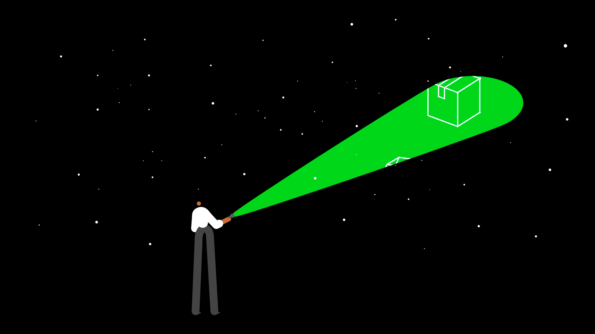

# llm-smart-home



# Setup
```
# Get Source Code
git clone https://github.com/cricel/llm-smart-home.git

# Set MechLLM Core Library as global package
# Add following into `~/.bashrc`
export PYTHONPATH=/path_to_folder/llm-smart-home/langchain_playground/scripts:$PYTHONPATH

# install necessary library
pip install .
# Add config into bashrc
pip install python-dotenv
dotenv -f .env run -- bash

from dotenv import load_dotenv
load_dotenv()

sudo chown -R $USER ~/.config/gcloud


rqt --standalone mechlmm_gui
```

## Postgresql
```
## user:~$
sudo -i -u postgres

## postgres@user:~$ 
psql

## postgres=# 
ALTER USER postgres PASSWORD 'mynewpassword';
```
## Simulation
```
# Install ROS2 Humble if not installed
# https://docs.ros.org/en/humble/Installation/Ubuntu-Install-Debs.html

# Compile ROS2 Simulation Environment
cd llm-smart-home/mechllm_ws/
colcon build --symlink-install
source install/setup.bash

# Run Simulation World
ros2 launch mechllm_bringup simulation_demo.launch.py 

## The Data Output is at '/path_to_folder/llm-smart-home/mechllm_ws/install/mechllm_bringup/share/mechllm_bringup`
# ROS2 Large Multimodal Model Testing
ros2 run mechllm_bringup mechllm_qa

# ROS2 Vison Integration Testing
ros2 run mechllm_bringup vision
```

## Run Detection Testing Code WITHOUT ROS
```
cd langchain_playground/scripts

# Large Multimodal Model Testing
# Comment out the testing code under `__main__` for different usage
python mechllm_core.py

# Vison Integration Testing
python vision_core.py
    # Under vision_core.py, in `__main__`

    # Uncomment this to use it for ROS
    #>> ros_main()

    # Uncomment this to use it WITHOUT ROS, and use camera view
    #>> vision_core = VisionCore(False)
    #>> vision_core.run()
```

### ATR Ollama Server IP: 
131.123.41.132
### Google Drive Share Resources: 
https://drive.google.com/drive/folders/1HYZvlaUuVLhMtZj_cshzsnftiEZ1T-9k?usp=drive_link
### Overleaf account
```coming soon```
